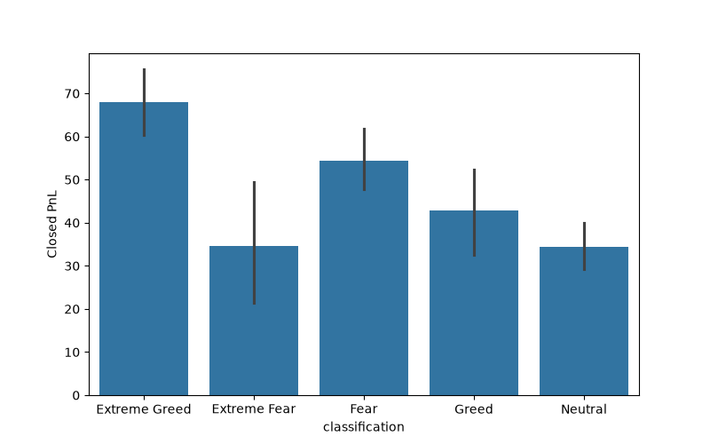
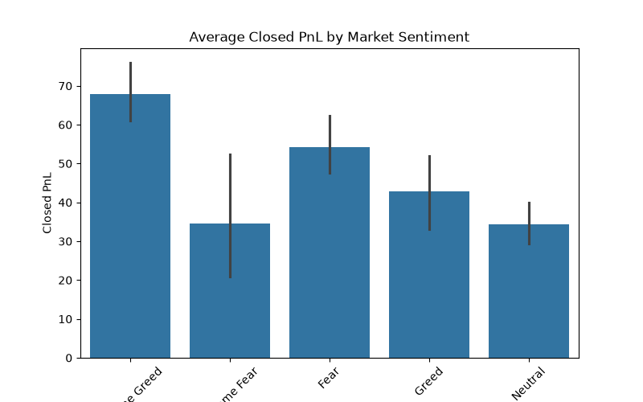
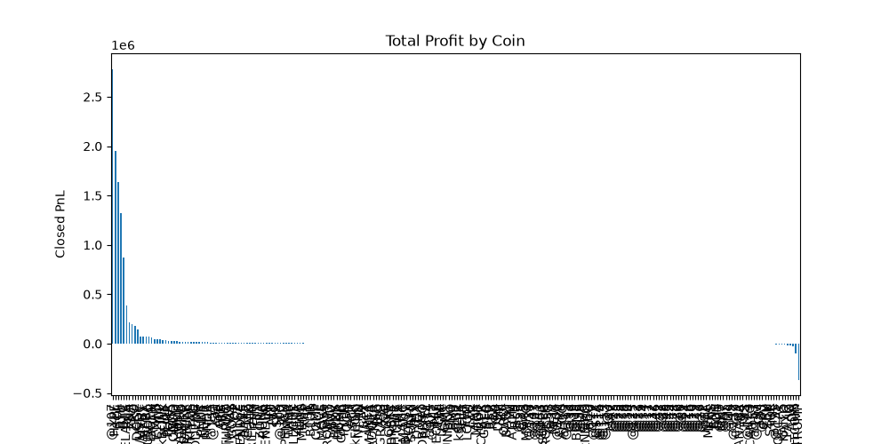
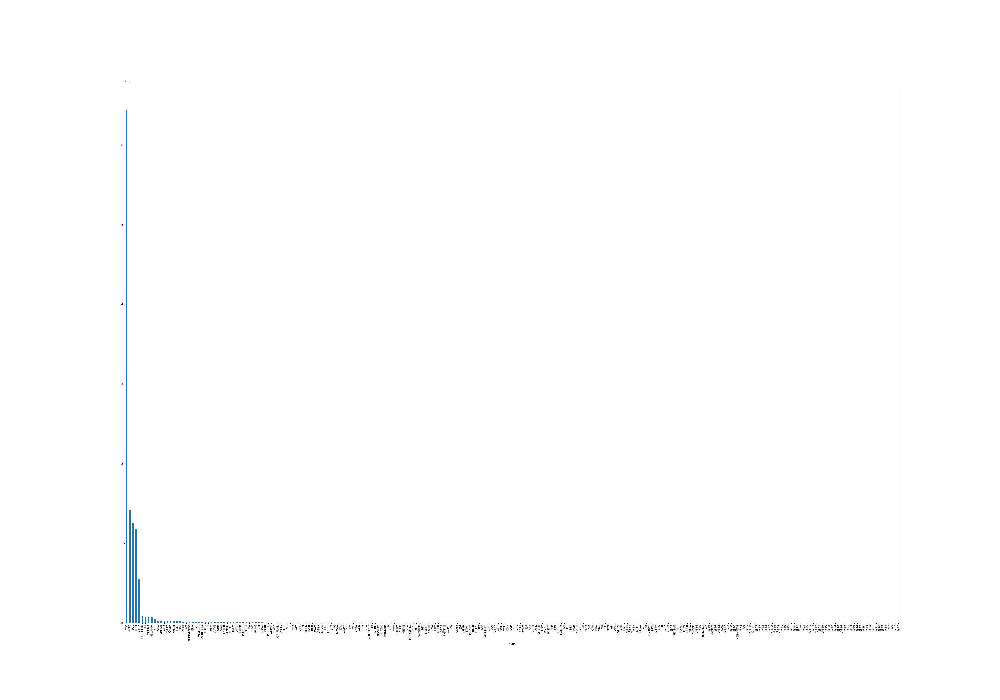
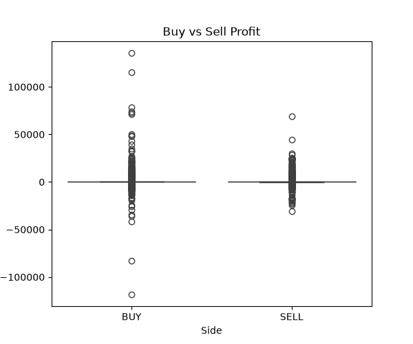
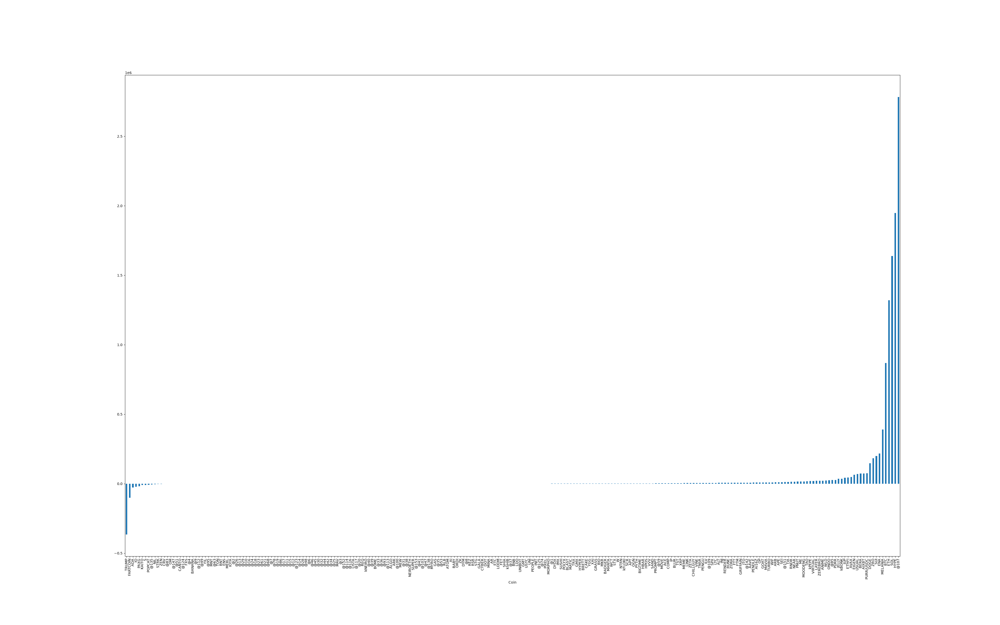
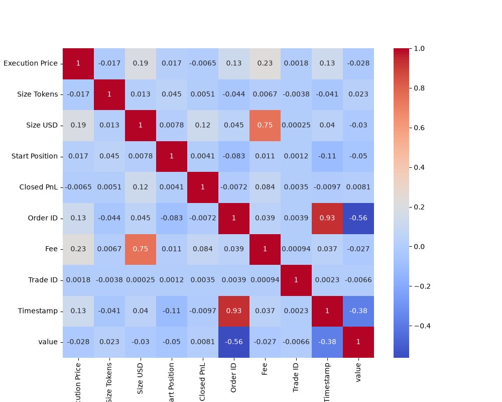

# 📈 Crypto Market Sentiment Analysis using Fear & Greed Index

> An end-to-end Data Analytics project that explores the relationship between **Bitcoin Market Sentiment (Fear & Greed Index)** and **cryptocurrency trader performance** using historical trading data.

---

# 🌐 Live Demo

## 📌 Project Overview

Financial markets are heavily influenced by investor psychology. This project investigates how market sentiment affects trader profitability by combining:

- 📊 Bitcoin Fear & Greed Index
- 💹 Historical Hyperliquid Trader Data

The goal is to identify hidden trading patterns and provide actionable business insights using Python and Data Analytics techniques.

---

# 🚀 Project Workflow

Raw Datasets
      │
      ▼
Data Cleaning
      │
      ▼
Data Preprocessing
      │
      ▼
Merge Both Datasets
      │
      ▼
Exploratory Data Analysis
      │
      ▼
Visualization
      │
      ▼
Business Insights
      │
      ▼
Recommendations

---

# 🛠️ Tech Stack

- Python
- Pandas
- NumPy
- Matplotlib
- Seaborn
- Jupyter Notebook

---

# 📂 Dataset

### Dataset 1

Bitcoin Fear & Greed Index

Columns

- Date
- Classification
- Value

### Dataset 2

Historical Trader Data

Columns

- Account
- Coin
- Execution Price
- Size Tokens
- Size USD
- Side
- Closed PnL
- Fee
- Timestamp
- Direction

---

# 📊 Data Cleaning

Performed the following preprocessing steps:

- Removed duplicate records
- Checked missing values
- Converted Timestamp into datetime format
- Extracted Date from Timestamp
- Standardized column names
- Merged trader data with market sentiment dataset

---

# 📈 Exploratory Data Analysis

Performed detailed analysis on:

- Market Sentiment Distribution
- Average Profit by Sentiment
- Total Profit by Sentiment
- Coin-wise Profitability
- Coin-wise Trading Volume
- Buy vs Sell Performance
- Fee Analysis
- Profit Distribution
- Correlation Analysis

---

# 📊 Visualizations

## 1️⃣ Market Sentiment Distribution

---

## 2️⃣ Average Profit by Sentiment

---

## 3️⃣ Coin-wise Profit

---

## 4️⃣ Trading Volume by Coin

---

## 5️⃣ Buy vs Sell Analysis

---

## 6️⃣ Closed PnL Distribution

---

## 7️⃣ Correlation Heatmap

---

# 📌 Key Insights

✅ Compared trader profitability during Fear and Greed market conditions.

✅ Identified the most profitable cryptocurrencies.

✅ Analyzed trading behaviour across different market sentiments.

✅ Compared Buy and Sell trade performance.

✅ Evaluated trading volume across different coins.

✅ Analyzed fee distribution and its relationship with trading activity.

---

# 💡 Business Recommendations

- Monitor market sentiment before opening large positions.

- Avoid emotional trading during Extreme Greed.

- Apply better risk management during Fear markets.

- Focus on coins that consistently generate better returns.

- Combine sentiment indicators with technical analysis for improved trading decisions.

---

# 📈 Results

The project successfully demonstrates how market sentiment influences trader behaviour and profitability by combining sentiment indicators with historical trading data.

The analysis provides valuable insights that can assist traders and analysts in making more informed trading decisions.

---

# 👨‍💻 Author

**Pawan Jogi**

📧 Email: pjpawan007@gmail.com

💻 GitHub: https://github.com/PawanJogi07

---
